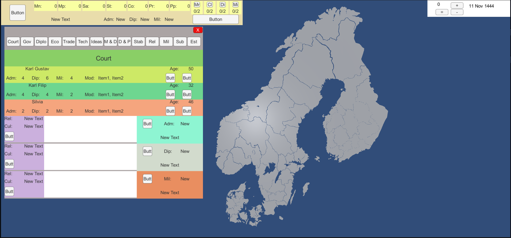

<!--
*** Thanks for checking out the Best-README-Template. If you have a suggestion
*** that would make this better, please fork the repo and create a pull request
*** or simply open an issue with the tag "enhancement".
*** Don't forget to give the project a star!
*** Thanks again! Now go create something AMAZING! :D
-->

<!-- PROJECT SHIELDS -->
<!--
*** I'm using markdown "reference style" links for readability.
*** Reference links are enclosed in brackets [ ] instead of parentheses ( ).
*** See the bottom of this document for the declaration of the reference variables
*** for contributors-url, forks-url, etc. This is an optional, concise syntax you may use.
*** https://www.markdownguide.org/basic-syntax/#reference-style-links
-->
[![Contributors][contributors-shield]][contributors-url]
[![Forks][forks-shield]][forks-url]
[![Stargazers][stars-shield]][stars-url]
[![Issues][issues-shield]][issues-url]
[![MIT License][license-shield]][license-url]
[![LinkedIn][linkedin-shield]][linkedin-url]

<!-- PROJECT LOGO -->
 

  

<h3 align="center">map_game</h3>

  

    A project in unity to design a map game base on the design of europa universalis 4
     
    <a href="https://github.com/ItzCornflakez/map_game"><strong>Explore the docs »</strong></a>
     
     
    <a href="https://github.com/ItzCornflakez/map_game">View Demo</a>
    ·
    <a href="https://github.com/ItzCornflakez/map_game/issues">Report Bug</a>
    ·
    <a href="https://github.com/ItzCornflakez/map_game/issues">Request Feature</a>
  

<!-- TABLE OF CONTENTS -->

  
Table of Contents

  <ol>
    <li>
      <a href="#about-the-project">About The Project</a>
      <ul>
        <li><a href="#built-with">Built With</a></li>
      </ul>
    </li>
    <li>
      <a href="#getting-started">Getting Started</a>
      <ul>
        <li><a href="#prerequisites">Prerequisites</a></li>
        <li><a href="#installation">Installation</a></li>
      </ul>
    </li>
    <li><a href="#usage">Usage</a></li>
    <li><a href="#roadmap">Roadmap</a></li>
    <li><a href="#contributing">Contributing</a></li>
    <li><a href="#license">License</a></li>
    <li><a href="#contact">Contact</a></li>
    <li><a href="#acknowledgments">Acknowledgments</a></li>
  </ol>

<!-- ABOUT THE PROJECT -->
## About The Project

Developed in unity this project looks to make a new version of the 10 year old game of europa universalis 4. The reason why this project was made was that there is so much lag and other stuff in europa universalis 4 that is caused by memory leaks and other issues that is a result of bad code.

(<a href="#top">back to top</a>)

### Built With

* [Unity](https://unity.com/)
* [c#](https://docs.microsoft.com/en-us/dotnet/csharp/)

(<a href="#top">back to top</a>)

<!-- GETTING STARTED -->
## Getting Started

This is an example of how you may give instructions on setting up your project locally.
To get a local copy up and running follow these simple example steps.

### Prerequisites

1. Unity hub with unity version 2021.1.0f1 Personal
2. A git console(git bash) 

### Installation

1. Create a new project in unity hub and just name it whatever you like.
2. navigate to its directory and setup a git repository. Pull the forked version of this project.
3. Now it is installed and ready to go.

(<a href="#top">back to top</a>)

<!-- USAGE EXAMPLES -->
## Usage

Use this space to show useful examples of how a project can be used. Additional screenshots, code examples and demos work well in this space. You may also link to more resources.

_For more examples, please refer to the [Documentation](https://example.com)_

(<a href="#top">back to top</a>)

<!-- ROADMAP -->
## Roadmap

See the [open issues](https://github.com/ItzCornflakez/map_game/issues) for a full list of proposed features (and known issues).

(<a href="#top">back to top</a>)

<!-- CONTRIBUTING -->
## Contributing

Contributions are what make the open source community such an amazing place to learn, inspire, and create. Any contributions you make are **greatly appreciated**.

If you have a suggestion that would make this better, please fork the repo and create a pull request. You can also simply open an issue with the tag "enhancement".
Don't forget to give the project a star! Thanks again!

1. Fork the Project
2. Create your Feature Branch (`git checkout -b feature/AmazingFeature`)
3. Commit your Changes (`git commit -m 'Add some AmazingFeature'`)
4. Push to the Branch (`git push origin feature/AmazingFeature`)
5. Open a Pull Request

(<a href="#top">back to top</a>)

<!-- LICENSE -->
## License

Distributed under the MIT License. See `LICENSE.txt` for more information.

(<a href="#top">back to top</a>)

<!-- CONTACT -->
## Contact

Your Name - [@Alexandersterb1](https://twitter.com/Alexandersterb1) - dikesalex@gmail.com

Project Link: [https://github.com/ItzCornflakez/map_game](https://github.com/ItzCornflakez/map_game)

(<a href="#top">back to top</a>)

<!-- ACKNOWLEDGMENTS -->
## Acknowledgments

* 
* 
* 

(<a href="#top">back to top</a>)

<!-- MARKDOWN LINKS & IMAGES -->
<!-- https://www.markdownguide.org/basic-syntax/#reference-style-links -->
[contributors-shield]: https://img.shields.io/github/contributors/ItzCornflakez/map_game.svg?style=for-the-badge
[contributors-url]: https://github.com/ItzCornflakez/map_game/graphs/contributors
[forks-shield]: https://img.shields.io/github/forks/ItzCornflakez/map_game.svg?style=for-the-badge
[forks-url]: https://github.com/ItzCornflakez/map_game/network/members
[stars-shield]: https://img.shields.io/github/stars/ItzCornflakez/map_game.svg?style=for-the-badge
[stars-url]: https://github.com/ItzCornflakez/map_game/stargazers
[issues-shield]: https://img.shields.io/github/issues/ItzCornflakez/map_game.svg?style=for-the-badge
[issues-url]: https://github.com/ItzCornflakez/map_game/issues
[license-shield]: https://img.shields.io/github/license/ItzCornflakez/map_game.svg?style=for-the-badge
[license-url]: https://github.com/ItzCornflakez/map_game/blob/master/LICENSE.txt
[linkedin-shield]: https://img.shields.io/badge/-LinkedIn-black.svg?style=for-the-badge&logo=linkedin&colorB=555
[linkedin-url]: https://linkedin.com/in/alexander-österberg-124358234
[product-screenshot]: images/screenshot.png
